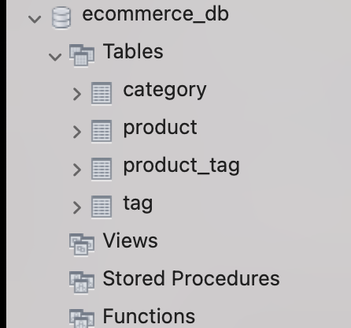
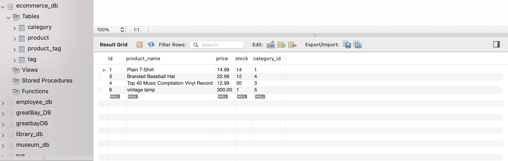
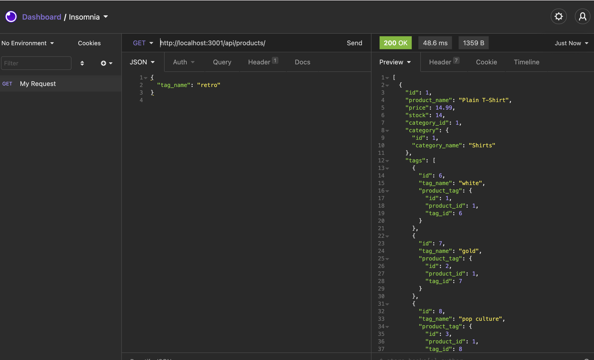

# e-commerce-backend-functionality

 # Description

 This progect is the backend functionality for an e-commerce business.
 It is programmed to interact with a mysql database making it easy to store and update data.
 It also has routes supplied so the user would only need to create the front-end aesthetic and let the program handle the functionality.

 # Table of Contents
 
 * [Installation](#installation)
 * [Useage](#useage)
 * [Contributing](#contributing)
 * [Tests](#tests)
 * [License](#license)
 * [Questions](#questions)

 # Useage
 The user creates a database with all their inventory, categories, tags ect. Using the routes supllied, the user is then able to view, create, update and delete all aspects of their saved inventory.
 
 Demo Video:  https://drive.google.com/file/d/1e1x6WygoGe3HZ8jrXhgNGvFyHRvI9JVP/view
 
 
 
 
 
 
 
 
 

 # Contributing
 Created by Madeleine O'Dea
 

 # License
  Licensed under MIT.
  For more information, visit this link.
  https://opensource.org/licenses/MIT
  
  
# Questions
For more examples of my work, please visit my GitHub at [madsterest](https://github.com/madsterest)
or contact me at
odea.madeleine@gmail.com
